# Proces week 1

## Idee movie timeline
Groundhog day


Je hebt een groundhog en als je scrollt graaft hij een gang en komt allemaal items tegen die te maken hebben met de film. Je kunt klikken op deze items en dan komt er informatie over de timeline.

Bijvoorbeeld een potlood, omdat aan het begin van de film hij een potlood breekt om zijn theorie te versterken.

Of een cowboy hoed en als je erop klikt krijg je tekst te zien dat hij de film meer dan 100 keer hebt gezien.

Als je naar beneden scrollt graaft hij, maar als je omhoog scrollt moet de animatie niet teruggaan, het moet linear zijn

## technical requirements

scroll animation
html button + css layout
html popups + css layout
misschien layers voor de css objecten
layers voor de clickible ground en het object erachter?
nesting

# Proces week 2

Mijn plan voor deze week is om de groundhog te maken met css. Ik had me ingeschreven voor een les 'vormpjes met css' en ben na die les verder gaan expirementeren. Ik had in mijn hoofd hoe ik de hierachy wou doen, maar het lukte me niet om de child objects te verplaatsen. Ik vroeg hulp aan Sanne en toen zijn we er al snel achter gekomen dat het kwam doordat ik een lijn code miste namelijk "position: absolute".


Nadat ik die lijn code had kon ik daadwerkelijk de groundhog maken. Ik begon met plaatjes vinden online in een simplistische stijl, omdat dat mij het makkelijkst leek.


Proces foto 1:


Daarna ging ik werken aan de ogen, maar het zag er nog steeds niet heel goed uit dus ik ging verder met de oren. Er klopte nog steeds iets niet, en ik besefte me het waren de pupillen. Dus toen ik die had toegevoegd samen met een outline, zag het er al veel beter uit.


Daarna ging ik aan de armen werken, maar het origin point was in de center, dus als ik de armen draaide zag het er heel slecht uit. Uiteindelijk vond ik "transform-origin: top;" Waarna het wel werkte.


Toen ik dit had, ging ik expirementeren met animaties, om te kijken of alles goed bleef zitten. 


## Feedback, Vooruitgang & Volgende Week

### Feedback

* maak de groundhog mooier, het ziet eruit alsof een 5 jarige dit heeft gemaakt.

### Vooruitgang

* groundhog
* gelaagdheid genegeerd

### volgende week

* groundhog graaf animatie

* meer groundhog

## Bronnen
border radius maker: https://www.dailytoolz.com/fancy-border-radius-generator/full-control-8-points.php#75.85.75.55-5.16.5.45-.

color pallete groundhog: https://www.color-hex.com/color-palette/1032945

css origin-top: https://www.w3schools.com/cssref/css3_pr_transform-origin.php


# Proces week 3

#### bever
Deze week was het plan om de groundhog af te maken en te beginnen aan de content van de timeline. De groundhog had nog handen en klauwen nodig, dus daar was mee begonnen. Eerst had ik elke klauw een apart object gemaakt. 

```html
<div></div>klauw links
<div></div>klauw midden
<div></div>klauw rechts
```

Dit kon beter dus ik ging kijken om een before en after te gebruiken. Dat liet de code er stukken beter uit zien.

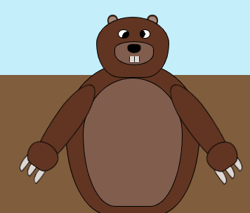

#### animatie
Daarna waren de voeten aan de beurt, maar aangezien er nog veel moest gebeuren besloot ik die over te slaan en in plaats daarvan de graaf animatie te maken. Na een tijdje experimenteren had ik een graaf animatie dit ik wel leuk vond. Toen ik het later aan Sanne liet zien zei hij dat de manier waarop ik had gedaan fout was. Ik gebruikte 'top', maar voor animaties gebruik je 'transform' omdat 'top' dingen op de pagina kan verplaatsen en transform niet.

```css
/* oude code */
@keyframes zwaaien1{
    0%{
        rotate: 185deg;
        top: 15%;
    }
    33%{
        top: 20%;
        rotate: 140deg;
    }
    66%{
        top: 25%;
        rotate: 185deg;
    }
    100%{
        rotate: 185deg;
        top: 15%;
    }
}
/* nieuw code */
@keyframes zwaaien1 {
    0%, 100% {
        transform: rotate(150deg) translateY(0%);
    }
    33% {
        transform: rotate(90deg) translateY(-5%);
    }
    66% {
        transform: rotate(150deg) translateY(-10%);
    }
}
```

Ik was op zoek naar een manier om de graaf animatie meerdere keren te laten spelen terwijl je scrollt en ik kwam er niet uit. Dus ik ging naar Sanne om hulp te vragen. Hij liet me 'animation-iteration-count' zien en dat was dat probleem opgelost.

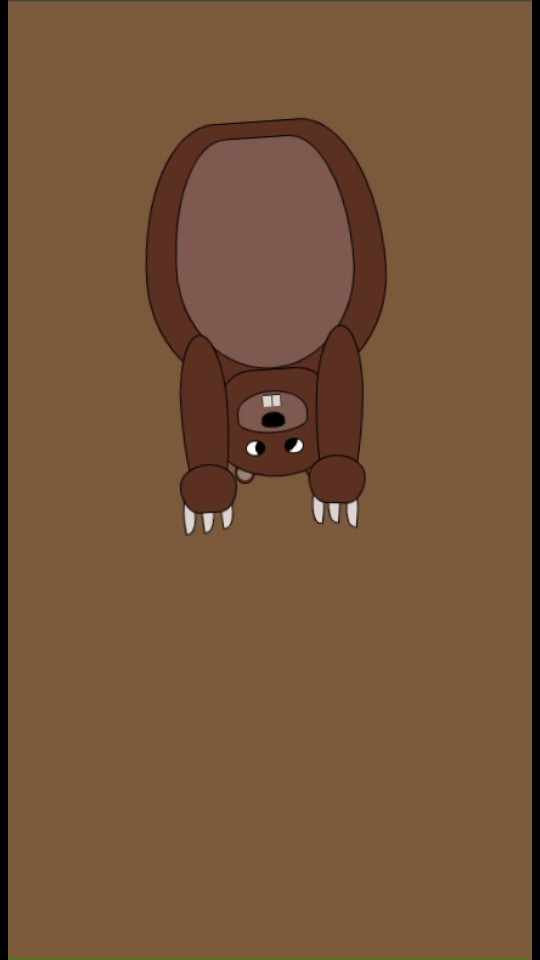

#### border
Sanne keek ook door me code heen en heeft ervoor gezorgd dat de border op elk onderdeel hetzelfde is doormiddel van een variabel.

```
--size-line:calc(  var(--size-bosmarmot) / 100);
```

#### code cleaning
Hij gaf me ook als tip om nog een keer mijn code opnieuw te schrijven, omdat ik nu in theorie beter ben. Dus ik ging kijken wat ik allemaal kon weghalen/verbeteren. Ik begon met de tanden die hetzelfde zijn behalve de locatie. Hetzelfde deed ik met de klauwen.


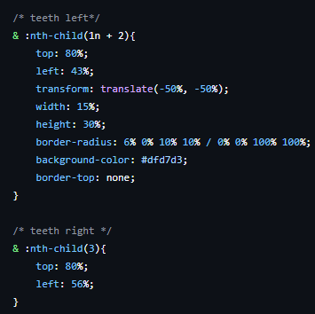

Vervolgens had ik het idee dat het wel goed was, maar toen ik verder dacht kreeg ik een idee om een functie te maken die op alle kinderen toegepast wordt. Hierin heb ik vervolgens de position, border, primary color en de border-radius ingezet. Deze kon ik vervolgens weghalen bij de rest van mijn code. Nu is er ook een standaard kleur en vorm, tenzij ik het anders aangeef.
```css
& :nth-child(1n){
        position:absolute;
        border: var(--size-line) solid var(--border-color);
        background-color: var(--primary-color-groundhog);
        border-radius: 85% 85% 55% 55% / 75% 75% 95% 95%;
    }
```

Ik heb ook de handen en middelste klauw verandert dat ze samen worden aangeroepen in plaats van apart.

```css
/* Left and right hands */
    > :nth-of-type(3) > :first-child, 
    >:nth-of-type(4) > :first-child{  
        bottom: -10%;
        width: 125%;
        height: 30%; 
        left: -15%;
        border-radius: 85% 85% 55% 55% / 75% 75% 95% 95%;
    }    
```

Ik ben uiteindelijk van 290 lijnen code naar 220 gegaan, en misschien kan het nog minder, maar ik momenteel niet weten hoe.

## expirementeren

#### timeline

Een groot gedeelte van de opdracht is de timeline. Het idee is dat je scrollt en dat de groundhog graaft en je dan stukken van de film tegenkomt. Ik moet ergens hierin style of container queries gebruiken. En hiermee liep ik heel erg vast. De code werkte niet en ik werd gefrusteerd. Uiteindelijk heb ik gewwon een plaatje en verder niks. De code die ik had heb ik weggegooid. Ik wou hetzelfde doen als hier beneden staat.

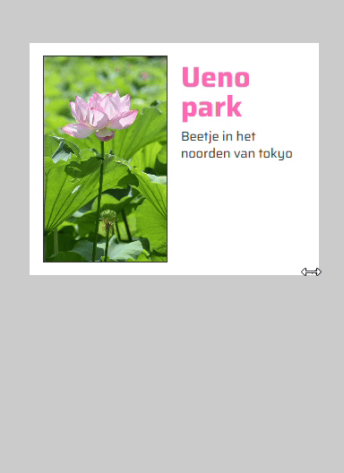

#### groundhog tot leven brengen

Ik was tevreden met de groundhog, maar het miste nog iets kwa leven. Dus ik dacht, wat brengt leven, ogen laten knipperen. De ogen heb ik gemaakt met een background radial gradient. Ik had een paar dingen geprobeerd, maar ben uiteindelijk op nog een radial gradient gekomen gebasseerd op een variabel die wordt verandert in een animatie.

```css
background-image:
        radial-gradient(circle at top, var(--primary-color-groundhog) var(--eye-closed), var(--secondary-color-groundhog) 0 calc(var(--eye-closed) * 1.2), transparent 0),
        radial-gradient(
        circle at bottom right, 
           black 50%,
           white 0
             );
             
             animation: blink 2s infinite;

@keyframes blink {
    0% {
        --eye-closed: 75%;
    }
    30%{
        --eye-closed: 0%;
    }

}
```

Vervolgens heb ik de oren ook een kleine wiggle gegeven door de rotation aan te passen.

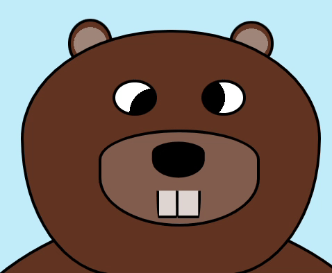

#### hover

Op het hoofd heb ik een hover toegevoegd die het hoofd klein maakt, de ogen veranderen en de oren spits maakt.

```css
&:hover{
        width: 35%;
        height: 20%;
        /* eyes */
        >:nth-child(2), >:nth-child(3){
            background-image:
            radial-gradient(circle at top, var(--primary-color-groundhog) var(--eye-closed), var(--secondary-color-groundhog) 0 calc(var(--eye-closed) * 1.2), transparent 0),
            radial-gradient(
            circle at center, 
               black 30%,
               white 0
                 );
        }
        /* ears */
        >:nth-child(4),
        >:nth-child(5){
            border-radius: 100% 0% 80% 30% / 80% 30% 100% 30%;
            rotate: -50deg;
         }
     }
```

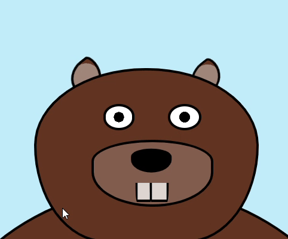

#### style querie

Ik moest ergens style queries toevoegen, maar het op de timeline toevoegen gaf me stress. Dus ik had het idee om als je op de neus klikt, de groundhog helemaal van kleur verandert. Dit heb ik met behulp van Sannes codepen gemaakt.

```css
 <label><div><input type="checkbox" name="radio" value="raccoon"></div></label><!--neus-->

/* stukje van de neus */
cursor:pointer;
& > input[type="checkbox"] {
 display: none;
}

 /* https://codepen.io/shooft/pen/jORqgdg?editors=1100 */
:root:has([value="raccoon"]:checked) {
	--colors:raccoon;
}

@container style(--colors:raccoon) {
	section:has(> div) {
		--primary-color-groundhog:#646464;
    --secondary-color-groundhog:#303030;
    --third-color-groundhog:#444444;
    --claw-color-groundhog:#330000;
	}
}
```

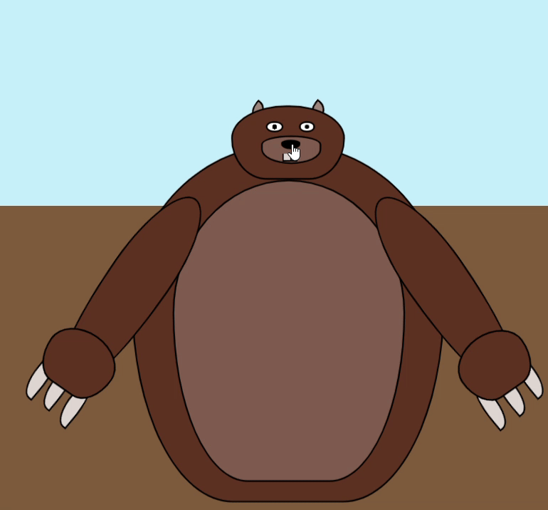

#### Container querie

Ik wou ook ergens containers queries gebruiken, maar met de timeline kwam ik er niet uit dus ik ging weer terug naar de bosmarmot. Een ding wat ik niet mooi vind eraan is de klauwen. Als het scherm te klein wordt zien ze er niet meer goed uit, dus mijn idee was om bij een bepaalde grootte een klauw uit te zetten, zodat de de 2 die overblijven groter kunnen zijn. En als het scherm nog kleiner is dat de klauwen helemaal verdwijnen. Iets waar ik heel erg mee vast liep is dat de buik later veranderde dan de klauwen en ik kwam er maar niet achter waarom. Ik had 'container-type' op de verkeerde plek gezet.

```css
/* https://developer.mozilla.org/en-US/docs/Web/CSS/CSS_containment/Container_queries */
@container (max-width: 90px) {
    section:has(> div) > div:first-child {
        width: 65%;
    }
   
    section:has(> div) > div:nth-child(3) > div:first-child > div:first-child,
    section:has(> div) > div:nth-child(4) > div:first-child > div:first-child{
        display: none;
    }
  }

  @container (max-width: 130px) {
    section:has(> div) > div:nth-child(3) > div:first-child > div:first-child,
    section:has(> div) > div:nth-child(4) > div:first-child > div:first-child{
        left: 30%;
        bottom: -30%;
        &::after{
            content:none;
        }
        &::before{
            bottom: -200%;
        }
    }
    section:has(> div) > div:nth-child(4) > div:first-child > div:first-child{
        left: 0%;
    }
  }
```

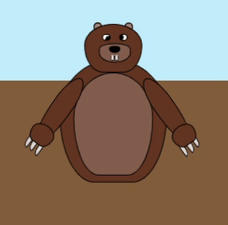

#### control panel test

Helemaal aan het begin van de opdracht kregen we de optie welke we wouden doen. Ik koos timeline omdat die me het makkelijkst leek, en nadat ik de film had gezien vond ik mijn idee ook leuk. Maar ik had ook een idee voor een control panel, alleen wist ik niet hoe ik dat wou doen. Maar nu heb ik die bosmarmot en ik kijk heel erg op tegen de timeline. Dus ik dacht ik ga experimenteren hiermee. In codepen heb ik een animatie gemaakt van flikkeren en samen met chatGPT (ookal was het meerendeels slecht) heb ik ervoor gezorgd dat het object verschijnt na de animatie.

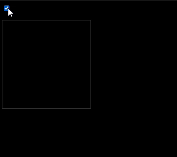

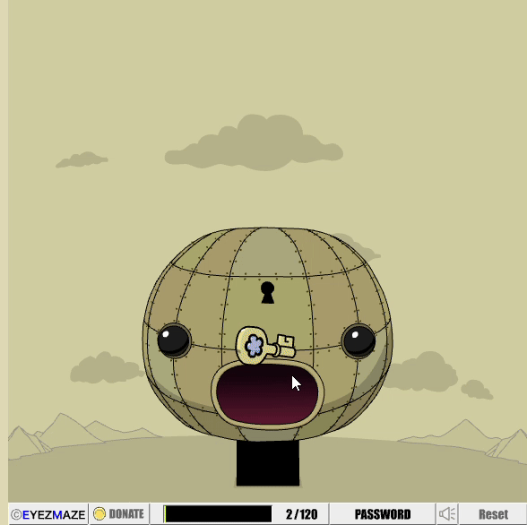

Hierna moest ik het toepassen op mijn code, die niet gebouwd is op interactie dus er waren heel veel errors. De manier waarop ik de code had gemaakt in de codepen werkte niet in het project, want ik had de logica omgedraaid. In de codepen was de achtergrond transparent totdat je klikte op de knop en dan kreeg het een kleur. In mijn project wil ik ook dat het transparent begint, maar alle logica staat diep genest en ik vind het daar ook fijn staan. Dus ik moest de logica omdraaien dat als de button niet gechecked het invisble is en zodra die gechecked is gaat hij de animatie afspelen van de flikker. Ook omdat er verschillende onderdelene zijn, wil ik de animatie deel voor deel afspelen, wat waarschijnlijk ook een slechte manier is gedaan. Dit kan uiteraad beter, maar het werkt.

```css
<label><input type="radio" name="radio" value="--arm"></label><!--body fur-->

section:has(input[value="--arm"]:not(:checked)) section:has(> div) > div:nth-child(3){
    border: transparent;
    background-color: transparent;
    &> :first-child{
        border: transparent;
        background-color: transparent;
        &> :first-child{
            border: transparent;
            background-color: transparent;
            &::after, &::before{
                border: transparent;
                background-color: transparent;
            }
        }
    }
    
}

section:has(input[value="--arm"]:checked) section:has(> div) > div:nth-child(3){
    animation: flickerBorder 1s linear, zwaaien1 linear;
    animation-timeline: auto, scroll();
    animation-range-start: 0, 30px;
    animation-iteration-count: 1, 5;
    &> :first-child{
        animation:invisible 1s linear, flickerBorder 1s linear 1s; 
    
        &> :first-child{
            animation: invisible 2s linear, flickerBorder 1s linear 2s;
            &::after, &::before{
                animation: invisible 2s linear, flickerBorder 1s linear 2s; 
            }
        }
    }
}

@keyframes invisible {
    0%, 100%{
        border-color: transparent;
      background-color: transparent;
    }
}
@keyframes flickerBorder {
    0%, 20%, 40%, 60%, 80%, 100%{
      border-color: transparent;
      background-color: transparent;
    }
    10%, 30%, 50%, 70%, 90% {
      border-color: white;
      background-color: transparent;
    }
  }
```
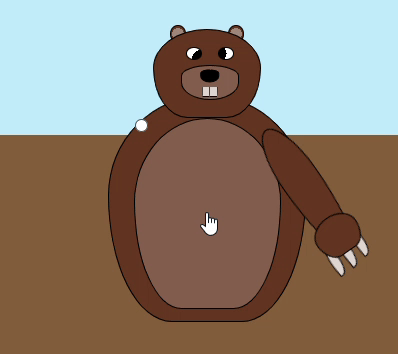

## feedback, vooruitgang & volgende week

### Feedback

### vooruitgang

* bosmarmot heeft klauwen

* bosmarmot graaft

* bosmarmot knippert

* soort van container en style queries gebruikt?

### volgende week

* control panel

## bronnen

https://thoughtbot.com/blog/transitions-and-transforms

https://thoughtbot.com/blog/css-animation-for-beginners

https://developer.mozilla.org/en-US/docs/Web/CSS/transition


# proces week 4

Deze week begon ik met besluiten dat ik ging switchen naar een control panel. Ik had een plan, niet een volledig plan, maar een plan.

* je klikt op de buik.
* armen verschijnen
* klik op armen
* als armen omhoog zijn verschijnt het hoofd als ballon
* de neus is een knop
* als het hoofd klaar is verschijnen de handen
* klik op de handen om de klauwen te laten verschijnen

Ik had vorige week al de buik gemaakt, dus nu begon ik met de armen. Sanne gaf me een link waarmee ik heel goed op weg kon.Toen ik het had vertaald naar mijn code werkte het ook, maar toen ging ik nesten en brak het. Samen met Niels heb ik het kunnen oplossen.

```css
& label:not(:last-of-type) {
                grid-area:1/1;	
                pointer-events:none;
                opacity:0;	
                width:100%;
                height:100%;	
                &:has( :checked ) + label{
                    pointer-events: all;
                }
            }

section:has(input[value="--Left-Arm-1"]:checked) section:has(> div) > :nth-child(3){transform: rotate(10deg);}
section:has(input[value="--Left-Arm-2"]:checked) section:has(> div) > :nth-child(3){transform: rotate(30deg);}
/* enzovoort */
```

Toen moest ik de hoofd animatie maken en mijn originele idee was een ballon die oppompt terwijl de armen omlaag vallen. Toen ik bezig was met de animatie kreeg ik iets was ik wel leuk vond en ik heb dat gepolished.

```css
@keyframes --head-appears {
    0%{
        transform-origin: bottom;
        transform:scaleY(0%) translateY(50%);
        z-index: -1;
    }
    40%, 60%{
        transform: scaleY(50%) translateY(50%);
        z-index: -1;
    }
    90%{
        transform:translateY(-25%);
    }
    100%{
        transform:scaleY(100%) translateY(0%);
    }
}
```
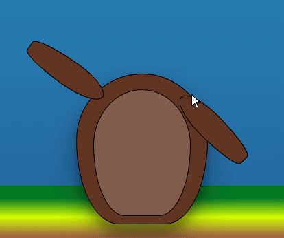

Vervolgens liep ik vast. Ik had het hoofd, maar hoe nu verder? Na veel nadenken besloot ik uiteindelijk om de snuit te laten verschijnen, zoals de armen deden, nadat het hoofd neergezet was. Vervolgens moet je klikken op de snuit om het te draaien en als die goed staat verschijnt de neus. Voor het draaien gebruikte ik dezelfde techniek als de armen. Daarna maakte ik de animatie van de snuit.

```css
@container style(--Trigger-Nose:true){
   section:has(>div) >:nth-child(2) > :first-child{
  animation:--snout-correct 2s linear forwards .2s;
   --scale: 3;
   --rotateY: 180deg;
        &> label:last-of-type{
            animation:--invisible 1s linear, --snout-correct 2s linear 1.2s;
            --rotateZ: 360deg;
            --scale: 3;
            --rotateY: 0deg;
            cursor:pointer;
        }
}}
/* ==SNOUTANIMATIONS== */
@keyframes --snout-correct {
0%{
    transform: scale(1, 1) rotateY(0deg) rotateZ(0deg);
    z-index: 3;
}
50%{
    transform: scale(var(--scale), var(--scale)) rotateY(var(--rotateY, 0)) rotateZ(var(--rotateZ, 0));
    z-index: 3;
}
100%{
    transform: scale(1, 1) rotateY(var(--rotateY, 0)) rotateZ(calc(var(--rotateZ, 0deg) * 2));
    z-index: 3;
}}
```
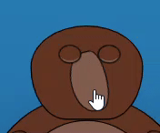

Toen ik de neus had moest de neus daadwerkelijk iets doen. Ik had niet veel tijd meer over dus ik besloot niet alle onderdelen van het hoofd puzzelstukjes te maken. De neus was de laatste.

Beginnend met de oren wou ik dat ze uit het hoofd popte, rondvlogen en dan in het andere oor gingen. Dit was veels te hoog gegrepen, dus inplaats daarvan bewegen de oren langs het hoofd en gaan ze in het andere oor.

Dit liet me denken als een aanknop die ingedrukt werd. Ik had al een knipper animatie, maar nu heb ik die knipper animatie ook eerst versneld afgespeeld. Om het gevoel te geven dat de groundhog wakker schrikt. Vervolgens liet ik de tanden verschijnen.

Nu het hoofd klaar was moesten de handen verschijnen. Wat ik met dezelfde knipper animatie deed als de armen.

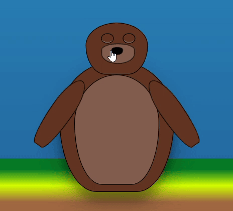

Als laatste stap wou ik de klauwen uitschuiven. Deze animatie had ik gelukkig al vorige week gemaakt.


En dan natuurlijk als laatste stap, de grand finale. Ik wou dat de groundhog weggraafde. Ik wou dat hij de lucht in sprong en draaide, maar 'technisch gezien' kijkt hij dan de verkeerde kant op, dus ik wou een halve verticale draai en een volledige horizontale draai. Dit had ik gemaakt, en toen was het 2D. Dus dat schrapte ik en nu draait hij alleen op de X as.

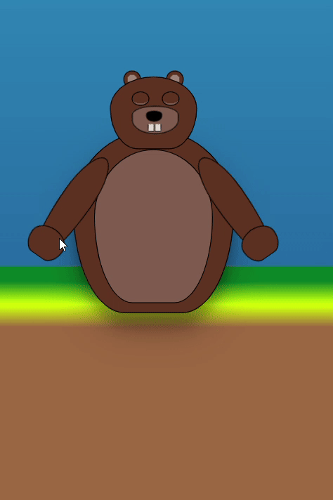

Daarna moest ik nog iets doen met tekst. Ik wou dat het uit de grond kwam en dat is met uiteindelijk gelukt. Maar ik kon geen mooie tekst kleur vinden. Dus toen heb ik met behulp van Elton de achtergrond verandert en een wave toegevoegd aan mijn titel. En deze titel verschijnt natuurlijk als de groundhog naar benenden graaft.

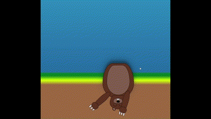

## bronnen

https://codepen.io/shooft/pen/emYvarP

chatGPT voor verwijzingen in code

Dante

Elton

Sanne

Roel

# reflectie

Het concept van dit project vind ik leuk. Dat ik mag kiezen tussen 3 opdrachten is goed. Ik heb natuurlijk eerst gekozen voor de movie timeline, terwijl ik eigenlijk de control panel leuker vond. Dit kwam omdat de movietimeline makkelijker leek en de control panel echt onmogelijk leek. Ik ben niet het beste in designen dus dat hield me heel erg tegen om de control panel te kiezen. Met de timeline bleek het designen ook veel meer dan verwacht en omdat ik daar dus slechter en ook nieuw maakte ik niet heel veel progressie de eerste 3 weken. Ik keek heel erg op tegen het maken van de timeline en toen ik er uiteindelijk moest lukte het niet en toen was ik daar ook echt klaar mee. Ik ben heel blij dat ik geswitched ben naar de control panel, want uiteindelijk was ik daar ook veel sneller mee. Uiteindelijk heb ik ook veel geleerd over css en voornamelijk nesting. Ik heb technieken gebruikt zoals:

* Nesting
* Style Queries
* Container Queries
* has
* animaties
* css in general

Ik heb nog een lange weg te gaan om daadwerkelijk met vertrouwen een site in elkaar te kunnen zetten, maar ik vond dit een redelijk begin.