# Proces week 1

## Idee movie timeline
Groundhog day

Je hebt een groundhog en als je scrollt graaft hij een gang en komt allemaal items tegen die te maken hebben met de film. Je kunt klikken op deze items en dan komt er informatie over de timeline.

Bijvoorbeeld een potlood, omdat aan het begin van de film hij een potlood breekt om zijn theorie te versterken.

Of een cowboy hoed en als je erop klikt krijg je tekst te zien dat hij de film meer dan 100 keer hebt gezien.

Als je naar beneden scrollt graaft hij, maar als je omhoog scrollt moet de animatie niet teruggaan, het moet linear zijn

## technical requirements

scroll animation
html button + css layout
html popups + css layout
misschien layers voor de css objecten
layers voor de clickible ground en het object erachter?
nesting

# Proces week 2

Mijn plan voor deze week is om de groundhog te maken met css. Ik had me ingeschreven voor een les 'vormpjes met css' en ben na die les verder gaan expirementeren. Ik had in mijn hoofd hoe ik de hierachy wou doen, maar het lukte me niet om de child objects te verplaatsen. Ik vroeg hulp aan Sanne en toen zijn we er al snel achter gekomen dat het kwam doordat ik een lijn code miste namelijk "position: absolute".

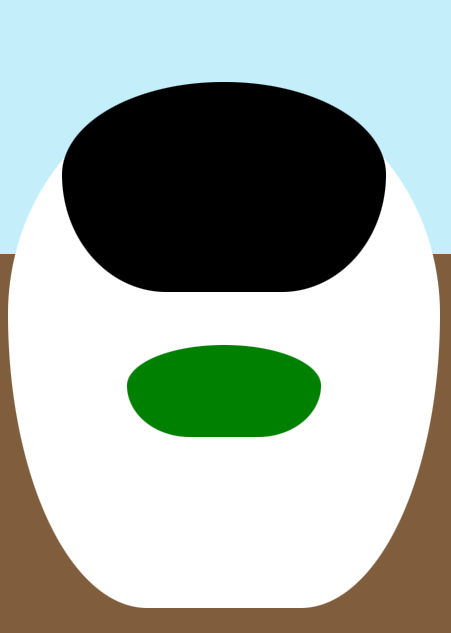

Nadat ik die lijn code had kon ik daadwerkelijk de groundhog maken. Ik begon met plaatjes vinden online in een simplistische stijl, omdat dat mij het makkelijkst leek.
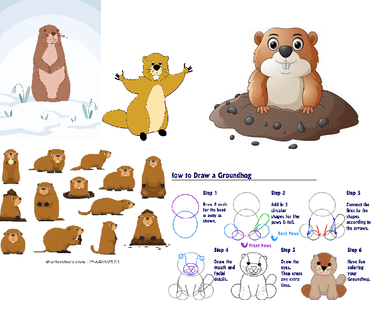

Proces foto 1:

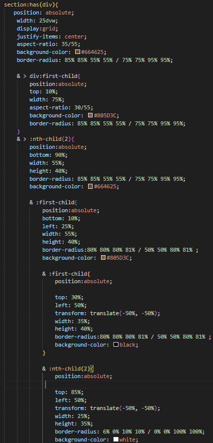
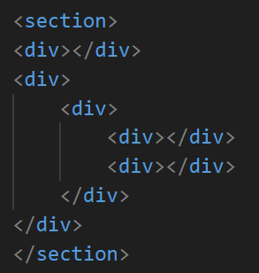
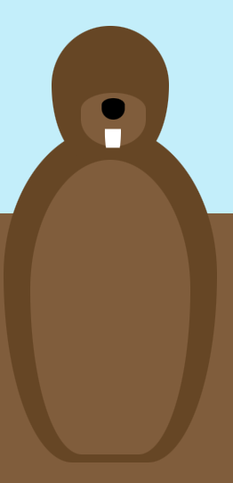

Daarna ging ik werken aan de ogen, maar het zag er nog steeds niet heel goed uit dus ik ging verder met de oren. Er klopte nog steeds iets niet, en ik besefte me het waren de pupillen. Dus toen ik die had toegevoegd samen met een outline, zag het er al veel beter uit.

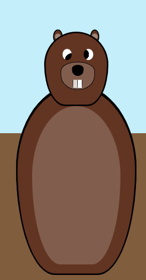

Daarna ging ik aan de armen werken, maar het origin point was in de center, dus als ik de armen draaide zag het er heel slecht uit. Uiteindelijk vond ik "transform-origin: top;" Waarna het wel werkte.

Toen ik dit had, ging ik expirementeren met animaties, om te kijken of alles goed bleef zitten. 

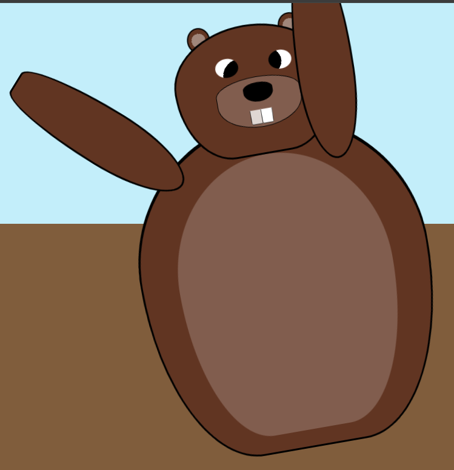

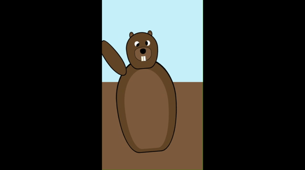

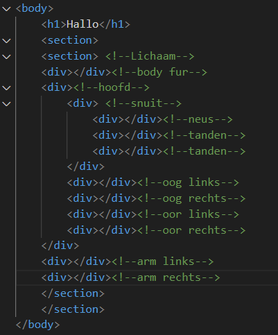

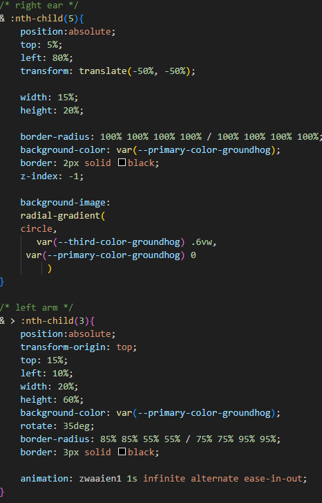

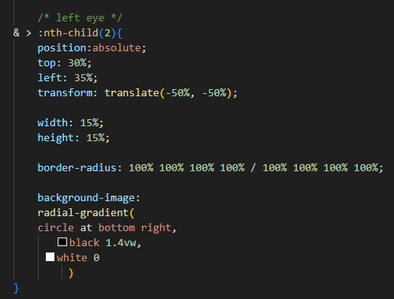

## Feedback, Vooruitgang & Volgende Week

### Feedback

* maak de groundhog mooier, het ziet eruit alsof een 5 jarige dit heeft gemaakt.

### Vooruitgang

* groundhog
* gelaagdheid genegeerd

### volgende week

* groundhog graaf animatie

* meer groundhog

## Bronnen
border radius maker: https://www.dailytoolz.com/fancy-border-radius-generator/full-control-8-points.php#75.85.75.55-5.16.5.45-.

color pallete groundhog: https://www.color-hex.com/color-palette/1032945

css origin-top: https://www.w3schools.com/cssref/css3_pr_transform-origin.php

# Proces week 3

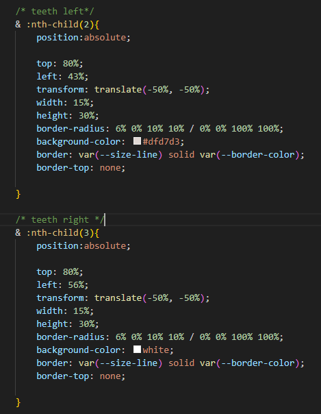

van 290 lines naar 219
## feedback, vooruitgang & volgende week

### Feedback

### vooruitgang

### volgende week