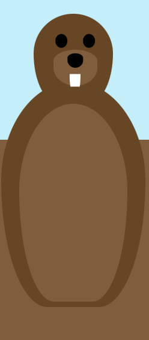

# Proces week 1

## Idee movie timeline
Groundhog day


Je hebt een groundhog en als je scrollt graaft hij een gang en komt allemaal items tegen die te maken hebben met de film. Je kunt klikken op deze items en dan komt er informatie over de timeline.

Bijvoorbeeld een potlood, omdat aan het begin van de film hij een potlood breekt om zijn theorie te versterken.

Of een cowboy hoed en als je erop klikt krijg je tekst te zien dat hij de film meer dan 100 keer hebt gezien.

Als je naar beneden scrollt graaft hij, maar als je omhoog scrollt moet de animatie niet teruggaan, het moet linear zijn

## technical requirements

scroll animation
html button + css layout
html popups + css layout
misschien layers voor de css objecten
layers voor de clickible ground en het object erachter?
nesting

# Proces week 2

Mijn plan voor deze week is om de groundhog te maken met css. Ik had me ingeschreven voor een les 'vormpjes met css' en ben na die les verder gaan expirementeren. Ik had in mijn hoofd hoe ik de hierachy wou doen, maar het lukte me niet om de child objects te verplaatsen. Ik vroeg hulp aan Sanne en toen zijn we er al snel achter gekomen dat het kwam doordat ik een lijn code miste namelijk "position: absolute".


Nadat ik die lijn code had kon ik daadwerkelijk de groundhog maken. Ik begon met plaatjes vinden online in een simplistische stijl, omdat dat mij het makkelijkst leek.


Proces foto 1:


Daarna ging ik werken aan de ogen, maar het zag er nog steeds niet heel goed uit dus ik ging verder met de oren. Er klopte nog steeds iets niet, en ik besefte me het waren de pupillen. Dus toen ik die had toegevoegd samen met een outline, zag het er al veel beter uit.




Daarna ging ik aan de armen werken, maar het origin point was in de center, dus als ik de armen draaide zag het er heel slecht uit. Uiteindelijk vond ik "transform-origin: top;" Waarna het wel werkte.


Toen ik dit had, ging ik expirementeren met animaties, om te kijken of alles goed bleef zitten. 


## Feedback, Vooruitgang & Volgende Week

### Feedback

* maak de groundhog mooier, het ziet eruit alsof een 5 jarige dit heeft gemaakt.

### Vooruitgang

* groundhog
* gelaagdheid genegeerd

### volgende week

* groundhog graaf animatie

* meer groundhog

## Bronnen
border radius maker: https://www.dailytoolz.com/fancy-border-radius-generator/full-control-8-points.php#75.85.75.55-5.16.5.45-.

color pallete groundhog: https://www.color-hex.com/color-palette/1032945

css origin-top: https://www.w3schools.com/cssref/css3_pr_transform-origin.php


# Proces week 3

#### bever
Deze week was het plan om de groundhog af te maken en te beginnen aan de content van de timeline. De groundhog had nog handen en klauwen nodig, dus daar was mee begonnen. Eerst had ik elke klauw een apart object gemaakt. 

```
<div></div>klauw links
<div></div>klauw midden
<div></div>klauw rechts
```

Dit kon beter dus ik ging kijken om een before en after te gebruiken. Dat liet de code er stukken beter uit zien.


#### animatie
Daarna waren de voeten aan de beurt, maar aangezien er nog veel moest gebeuren besloot ik die over te slaan en in plaats daarvan de graaf animatie te maken. Na een tijdje experimenteren had ik een graaf animatie dit ik wel leuk vond. Toen ik het later aan Sanne liet zien zei hij dat de manier waarop ik had gedaan fout was. Ik gebruikte 'top', maar voor animaties gebruik je 'transform' omdat 'top' dingen op de pagina kan verplaatsen en transform niet.

```
/* oude code */
@keyframes zwaaien1{
    0%{
        rotate: 185deg;
        top: 15%;
    }
    33%{
        top: 20%;
        rotate: 140deg;
    }
    66%{
        top: 25%;
        rotate: 185deg;
    }
    100%{
        rotate: 185deg;
        top: 15%;
    }
}
/* nieuw code */
@keyframes zwaaien1 {
    0%, 100% {
        transform: rotate(150deg) translateY(0%);
    }
    33% {
        transform: rotate(90deg) translateY(-5%);
    }
    66% {
        transform: rotate(150deg) translateY(-10%);
    }
}
```

Ik was op zoek naar een manier om de graaf animatie meerdere keren te laten spelen terwijl je scrollt en ik kwam er niet uit. Dus ik ging naar Sanne om hulp te vragen. Hij liet me 'animation-iteration-count' zien en dat was dat probleem opgelost.


#### border
Sanne keek ook door me code heen en heeft ervoor gezorgd dat de border op elk onderdeel hetzelfde is doormiddel van een variabel.

```
--size-line:calc(  var(--size-bosmarmot) / 100);
```

#### code cleaning
Hij gaf me ook als tip om nog een keer mijn code opnieuw te schrijven, omdat ik nu in theorie beter ben. Dus ik ging kijken wat ik allemaal kon weghalen/verbeteren. Ik begon met de tanden die hetzelfde zijn behalve de locatie. Hetzelfde deed ik met de klauwen.


Vervolgens had ik het idee dat het wel goed was, maar toen ik verder dacht kreeg ik een idee om een functie te maken die op alle kinderen toegepast wordt. Hierin heb ik vervolgens de position, border, primary color en de border-radius ingezet. Deze kon ik vervolgens weghalen bij de rest van mijn code. Nu is er ook een standaard kleur en vorm, tenzij ik het anders aangeef.
```
& :nth-child(1n){
        position:absolute;
        border: var(--size-line) solid var(--border-color);
        background-color: var(--primary-color-groundhog);
        border-radius: 85% 85% 55% 55% / 75% 75% 95% 95%;
    }
```

Ik heb ook de handen en middelste klauw verandert dat ze samen worden aangeroepen in plaats van apart.

```
/* Left and right hands */
    > :nth-of-type(3) > :first-child, 
    >:nth-of-type(4) > :first-child{  
        bottom: -10%;
        width: 125%;
        height: 30%; 
        left: -15%;
        border-radius: 85% 85% 55% 55% / 75% 75% 95% 95%;
    }    
```

Ik ben uiteindelijk van 290 lijnen code naar 220 gegaan, en misschien kan het nog minder, maar ik momenteel niet weten hoe.

## expirementeren

####

## feedback, vooruitgang & volgende week

### Feedback

### vooruitgang

### volgende week